


 



&nbsp;


- 🚀 Writing code since **2005**. Today **ZoolCoder** builds Arabic-first, right-to-left, offline-first products.
- 🏛️ Professional since 2012: national e-passport and civil-registration platforms, ID-document systems for government programmes, enterprise microservices and cloud-native full stack.
- 🤖 **AI champion & engineer since 2023**: I integrate LLMs, coding agents, MCP tools and on-device ML into the whole flow, from spec to review to release, and into the products themselves.
- ☁️ AWS Certified Developer and Google Cloud Associate Cloud Engineer (2023).
- 🧩 One engineer end to end: Spring Boot backends, Vue web apps, Flutter mobile, 3D on the web.
- 🟢 Many products running live in production across web, mobile, POS and 3D. Product names stay private; a few are outlined below.
- 🛠️ Currently: AI agents in the build pipeline, UAE e-invoicing for a POS platform, a self-hosted project tracker, and a 3D web museum.






 
 
 


<table>
<tr><td><code>LANGUAGES</code></td><td></td></tr>
<tr><td><code>BACKEND</code></td><td></td></tr>
<tr><td><code>FRONTEND</code></td><td></td></tr>
<tr><td><code>MOBILE</code></td><td></td></tr>
<tr><td><code>DATA</code></td><td></td></tr>
<tr><td><code>CLOUD</code></td><td></td></tr>
<tr><td><code>DEVOPS</code></td><td></td></tr>
<tr><td><code>TESTING</code></td><td></td></tr>
</table>


<picture>
  <source media="(prefers-color-scheme: dark)" srcset="https://raw.githubusercontent.com/ZoolCoder/ZoolCoder/output/snake-dark.svg"/>
  
</picture>

<a href="https://zoolcoder.com"></a>

